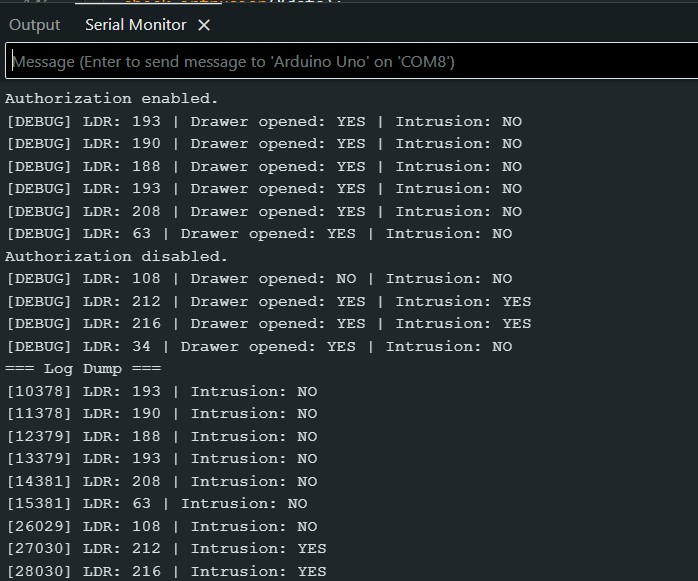
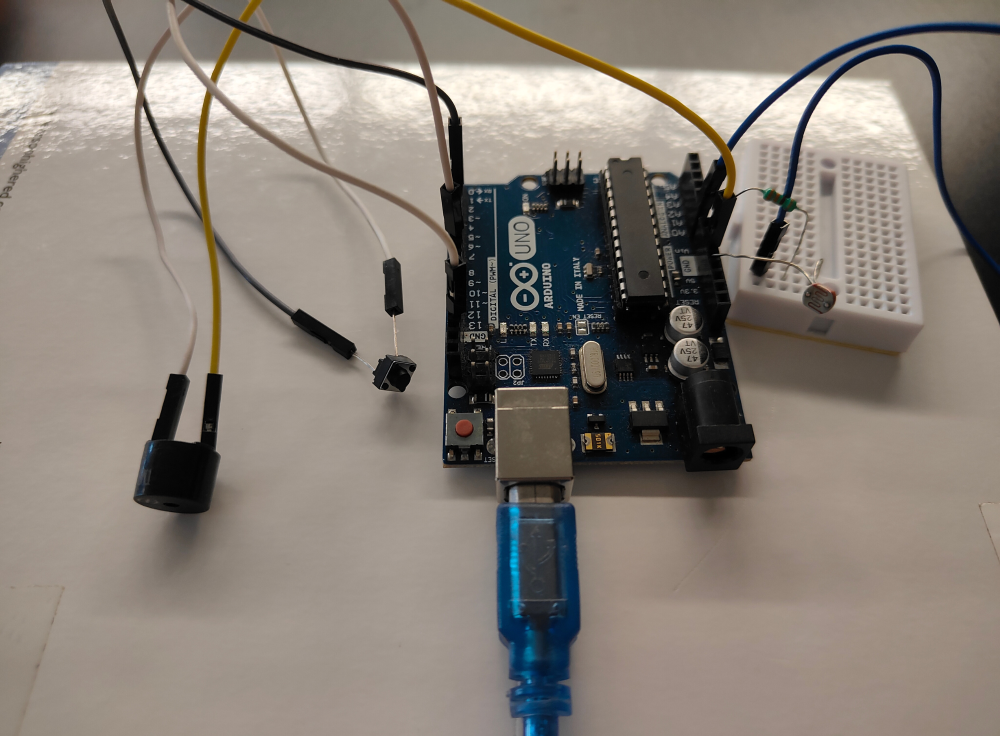

# 🔐 Low-Power Light-based Intrusion Logger using Arduino

A power-efficient intrusion detection system built on Arduino Uno. The system detects unauthorized access in small enclosures (like lockers or drawers) using a **photoresistor (LDR)** and a **button** to log activity, trigger alerts, and enter low power sleep during inactivity.

## 🚀 Features

- 📉 **Light Change Detection** via LDR
- 🔘 **Drawer Open Detection** via Push Button
- 🔔 **Buzzer Alerts** for unauthorized intrusions
- 💾 **Event Logging** in RAM with timestamps
- 💤 **Sleep Mode** for conserving power during inactivity
- 🔄 **Serial Interface** for control and log retrieval

---

## 🛠️ Hardware Requirements

- Arduino Uno
- Photoresistor (LDR)
- 330Ω Resistor (for LDR voltage divider. preferrably 10kΩ)
- Push Button
- Buzzer
- Breadboard + Wires

---

## ⚙️ System Behavior

| Component | Role |
|----------|------|
| **LDR** | Senses light — used to detect sudden brightness change when drawer is opened |
| **Button (Active LOW)** | Indicates drawer is physically opened or closed |
| **Buzzer** | Sounds alarm when intrusion is detected |
| **Sleep Mode** | Arduino sleeps when drawer is closed and no activity occurs |
| **Serial Monitor** | Accepts commands and displays logs |

---

## 📋 Serial Commands

| Command | Description |
|--------|-------------|
| `AUTH YES` | Enable authorized access — alerts won't trigger |
| `AUTH NO`  | Disable authorization — triggers alerts on intrusion |
| `LOG`      | Print all intrusion log entries stored in RAM |

---

## 🧠 Intrusion Logic

- Intrusion is detected when:
  - Authorization is **disabled**
  - LDR detects **light above threshold**
  - Drawer (button) is **open**

---

## 🔄 Power Management

- Uses **interrupt-driven wakeup** on drawer open/close via button
- Sleeps using `SLEEP_MODE_IDLE` to preserve Serial + timers
- Can be modified to use `SLEEP_MODE_PWR_DOWN` for deeper sleep when not logging

---

## 🧾 Sample Serial Output

## 🎥 Demo
Check out the  to view the entire video showing how it works.  

## 📝 Future Work
- Add EEPROM /SD Card logging for non-volatile storage
- Add LED indicator along with buzzer
- Upgrade to deep sleep with external interrupt-only wakeup
